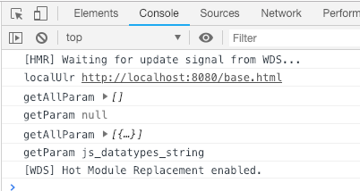

# webpack4.x 创建自己的 library 并发布到 npm

## 一、创建自己的类库

新建目录如下
```
[utils]
  |-- examples
    |-- base.js
    |-- base.html
  |-- src
    |-- index.js
  |-- package.json
  |-- webpack.prd.config.js
  |-- webpack.dev.config.js
```

安装依赖如下  
tnpm i @babel/core @babel/plugin-transform-runtime @babel/preset-env babel-loader webpack webpack-cli webpack-dev-server -D  
这里注意下案例里用的版本号


<font color="deeppink">utils/package.json</font>
```json
{
  "name": "sakurayeah-utils",
  "version": "0.0.2",
  "description": "使用webpack打包的一个js库，上传到npm",
  "main": "./dist/index.js",
  "scripts": {
    "dev": "webpack-dev-server --config webpack.dev.config.js --content-base examples --inline --hot",
    "build": "webpack --config webpack.prd.config.js -p"
  },
  "repository": {
    "type": "git",
    "url": "git@github.com:sakurayeah/sakurayeah-utils.git"
  },
  "author": "sakurayeah <katrina136@163.com>",
  "keywords": [
    "webpack",
    "url"
  ],
  "license": "ISC",
  "bugs": {
    "url": "https://github.com/sakurayeah/sakurayeah-utils/issues"
  },
  "homepage": "https://github.com/sakurayeah/sakurayeah-utils/blob/master/readme.md",
  "devDependencies": {
    "@babel/core": "^7.1.2",
    "@babel/plugin-transform-runtime": "^7.1.0",
    "@babel/preset-env": "^7.3.1",
    "babel-loader": "^8.0.4",
    "webpack": "^4.26.0",
    "webpack-cli": "^3.1.2",
    "webpack-dev-server": "^3.1.14"
  }
}
```

- name: npm 包的名字（可以先去 npm 里搜索下，看是否重名）
- version: npm 包的版本号，每次发布时主要要更新版本号
- scripts: 当运行 npm run dev 时，用作测试；当运行 npm run build 时，进行打包压缩
- main: 指定程序的主入口
- description: 描述
- repository: 指定代码存放地址
- author: 作者信息
- keywords: 关键字
- license: 协议
- bugs 提交 bug 的地方
- homepage 主页


<font>utils/src/index.js</font>
```js
// 获取当前页面url
export const localUlr = window.location.href;

// 获取全部参数
export const getAllParam = (url = '') => {
  url = url || localUlr;
  const result = [];
  const query = url.split("?")[1];
  if (query) {
    const queryArr = query.split("&");
    queryArr.forEach(function(item){
      const obj = {};
      const value = item.split("=")[1];
      const key = item.split("=")[0];
      obj[key] = value;
      result.push(obj);
    });
  }
  return result;
}

// 获取指定参数
export const getParam = (name = '', url = '') => { 
  const reg = new RegExp("(^|&)" + name + "=([^&]*)(&|$)", "i");
  const urlObj = url ? new URL(url) : window.location;
  const r = urlObj.search.substr(1).match(reg); 
  if (r != null) return unescape(r[2]); 
  return null; 
} 
```

这里写了三个简单的方法，localUlr 获取当前页面的 url，getAllParam 获取 url 带的全部参数，getParam 获取 url 里指定的参数

先来看 webpack 构建打包的配置  
<font>utils/webpack.prd.config.js</font>
```js
const path = require('path');
const webpack = require('webpack');

module.exports = {
  mode: "production",
  entry: { // 入口
    index: './src/index.js',
  },
  output: {
    path: path.resolve(__dirname, 'dist'),
    libraryTarget: 'umd',
    library: 'utils',
  },
  module: {
    rules: [
      {
        test: /\.js$/,
        include: [
          path.resolve(__dirname, 'src')
        ],
        exclude: /(node_modules)/,
        loader: "babel-loader",
        options: {
          presets: ['@babel/preset-env'],
          plugins: ["@babel/plugin-transform-runtime"]
        },
      },
    ]
  },
}
```

- mode
  模块，development|production

- module
  使用 babel 编译 js。注意：这里使用了 @babel/core 8.x，stage-*已弃用，使用 @babel/preset-env

- entry
  入口

- output
  出口
  + libraryTarget：定义打包方式Universal Module Definition,同时支持在CommonJS、AMD和全局变量使用
  + 指定类库名,主要用于直接引用的方式(比如使用script 标签)

npm run build 的时候，使用的是`webpack.prd.config.js`，默认打包到 dist 文件夹中。output 中没有指定文件名，打包生成的文件会自动使用 entry 里设置的名字`index`。所以 `package.json` 中 `main` 字段指定的路径是 `./dist/index.js`。


## 二、测试

下面再来看测试的部分，先写一个测试案例
<font>utils/examples/base.html</font>
```html
<!DOCTYPE html>
<html lang="en">
<head>
  <meta charset="UTF-8">
  <meta name="viewport" content="width=device-width, initial-scale=1.0">
  <meta http-equiv="X-UA-Compatible" content="ie=edge">
  <title>Document</title>
</head>
<body>
  <script src="./example.js"></script>
</body>
</html>
```

<font>utils/examples/base.js</font>
```js
import { localUlr, getAllParam, getParam } from '../src/index';

// 当前页面
console.log('localUlr', localUlr)
console.log('getAllParam', getAllParam())
console.log('getParam', getParam('f'))

// 指定 url
const url = 'http://www.w3school.com.cn/tiy/t.asp?f=js_datatypes_string'
console.log('getAllParam', getAllParam(url))
console.log('getParam', getParam('f', url))
```

<font>utils/webpack.dev.config.js</font>
```js
const path = require('path');
const webpack = require('webpack');

module.exports = {
  mode: "development",
  entry: { // 入口
    example: './examples/base.js'
  },
  output: {
    path: path.resolve(__dirname, 'dist'),
  },
  module: {
    rules: [
      {
        test: /\.js$/,
        include: [
          path.resolve(__dirname, 'src')
        ],
        exclude: /(node_modules)/,
        loader: "babel-loader",
        options: {
          presets: ['@babel/preset-env'],
          plugins: ["@babel/plugin-transform-runtime"]
        },
      },
    ]
  },
}
```

当运行 npm run dev 时，使用的是 webpack.dev.config.js, 并且指定了打开的文件夹为 examples，在浏览器打开 http://localhost:8080/base.html 就可以在 console 里看到效果如下所示



我们在 `webpack.dev.config.js` 里配置了入口文件为 `./examples/base.js` 并命名成 `example`。

因此，在 `base.html` 里引入的 js 是 `./example.js`

在 `base.js` 里我们需要使用开发的 utils 功能，直接引入 打包时设置的 入口文件 `../src/index`。在这里可以直接测试你代码写的是否有问题，不用发布后再去测试


## 三、发布

首先需要一个账号，没有的先去 [npm](https://www.npmjs.com/) 注册。注意，在终端登录时需要使用 账户、密码、邮箱，注册的时候要将邮箱验证通过，否则无法发布

首先在终端登录账号 `$ npm adduser` `$ npm login` 

如果是更新包，在上传前要确保 `版本号` 已经更新过。

先构建 `$ npm run build`

在发布 `$ npm publish`


## 四、使用
安装 $ npm i sakurayeah-utils --save-dev

在项目中使用
```js
import { localUlr, getAllParam, getParam } from 'sakurayeah-utils';

console.log('localUlr', localUlr)

const url = 'http://www.w3school.com.cn/tiy/t.asp?f=js_datatypes_string'
console.log('getAllParam', getAllParam(url))
console.log('getParam', getParam('f', url))
```


